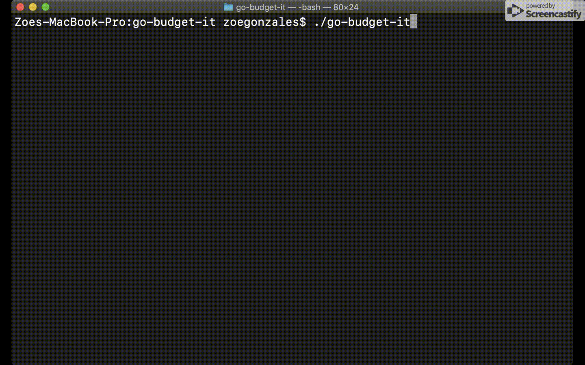

# go-budget-it
This is a CLI app that enables users to add, view, update, and delete budgets and transactions.

## Tools
Go, SQL, MySQL

## Set up
**Requirements:** MySQL, Go

Clone this repo.

To set up the database, enter the MySQL shell with `mysql -u username -p` and enter your password.

Create database and tables: `source path/to/project/schemas.sql`

**Note:** Above path can be obtained by running `pwd` in the directory in which the repo was cloned.

If successful, your database will be set up.

Now, run `go build` and then any of the commands below.

## Commands

**Important:** All commands begin with `./go-budget-it`

ADD  
`add budget <name> <allowance>`  
`add transaction <name/description> <amount> <budget_id>`

VIEW  
`get budgets`  
`get transactions`

UPDATE  
`update budget <budget_id> <new_allowance>`  
`update transaction <transaction_id> <new_amount>`

DELETE  
`delete budget <budget_id>`  
`delete transaction <transaction_id>`

INNER JOIN transactions with budgets on budget_id  
`join-on`

## Demo

ADD

UPDATE

DELETE
